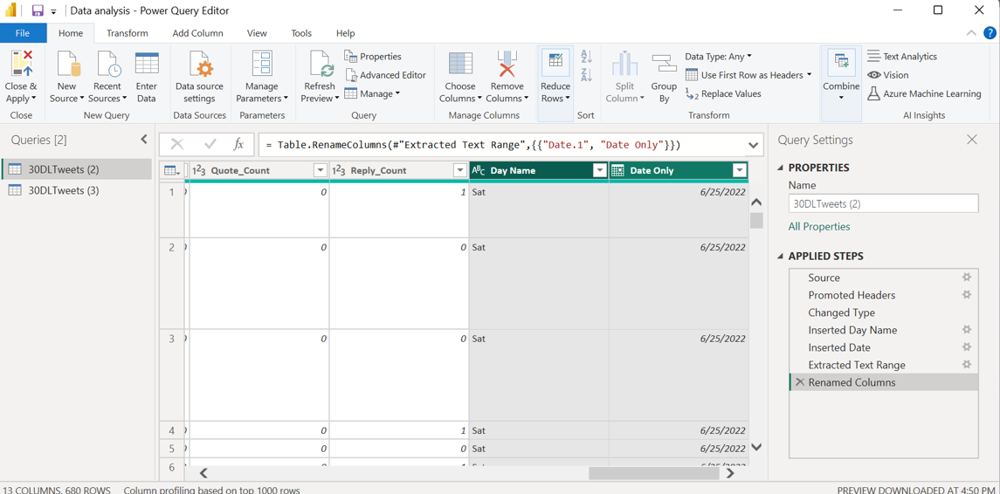
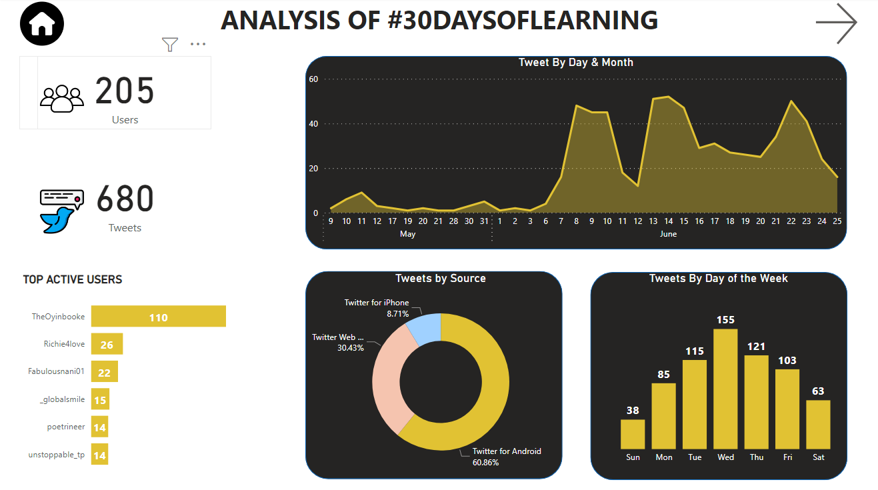
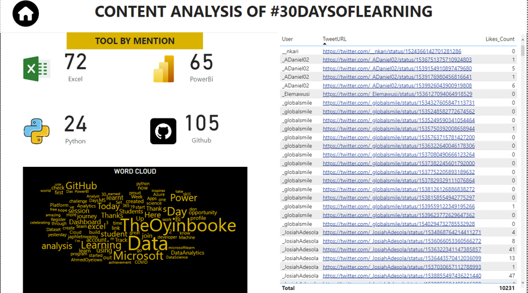
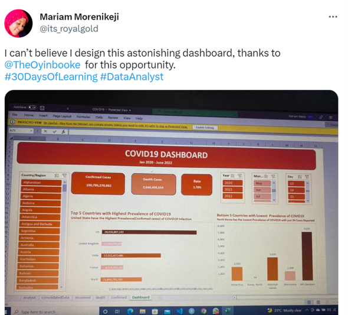

# Twitter-Analytics-of-30daysoflearning
A Social media analytics report on the #30daysoflearning

## Introduction
The #30DAYSOFLEARNING Twitter hashtag analysis project aims to delve into the engagement and reachrelated to this specific hashtag. By utilizing the powerful data analysis tool, Power BI, this project offers valuable insights into the effectiveness and impact of the #30DAYSOFLEARNING campaign.By leveraging the capabilities of Power BI, we can visualize and explore the data in an interactive and informative manner, ultimately enabling stakeholders to make data-driven decisions for future initiatives. 

## Problem Statement
The #30DAYSOFLEARNING Twitter hashtag campaign aims to promote learning and knowledge sharing among online communities. However, a comprehensive analysis of the campaign's engagement and reach on Twitter is necessary to assess its effectiveness and understand its impact. Without proper analysis, it is challenging to determine the level of user engagement, the extent of reach within the target audience, and other key metrics related to the campaign's success. This lack of insights hinders stakeholders' ability to make informed decisions for future initiatives, optimize campaign strategies, and accurately measure the impact of the #30DAYSOFLEARNING campaign. Therefore, the problem at hand is to analyze the Twitter data associated with the #30DAYSOFLEARNING hashtag and utilize Power BI to extract meaningful insights regarding engagement, reach, and user demographics. By addressing this problem, we can provide stakeholders with valuable information that empowers them to evaluate the campaign's effectiveness, make data-driven decisions, and further enhance the impact of the #30DAYSOFLEARNING campaign in promoting a culture of continuous learning.

## Skills Demonstrated 
This project demonstrates proficiency in data collection, data preparation, data analysis using Power BI, data visualization, insight generation, effective communication, and utilizing data for decision-making purposes.

## Data Sourcing
Data was scrapped from twitter using Python and saved into a CSV file.

## Data Transformation
During the data preparation phase of the #30DAYSOFLEARNING Twitter hashtag analysis, several data transformations were performed to extract relevant information from the collected dataset. The following transformations were applied:

- Date Extraction: A new column was created to extract the date from the existing timestamp column. This transformation enables easier analysis and visualization based on specific dates.

- Day Name Extraction: Another new column was created to extract the day name (e.g., Monday, Tuesday) from the timestamp. This transformation provides insights into daily trends and patterns related to the hashtag.

- Day Name Abbreviation: To further enhance readability and visual presentation, the first three letters of the day name were extracted to create an abbreviated version (e.g., Mon, Tue). This transformation allows for concise representation of the day names in visualizations and analysis.

By performing these data transformations, the dataset now includes additional columns for date, day name. These transformations enable more granular analysis and visualization of the #30DAYSOFLEARNING hashtag data, specifically focusing on specific dates and daily patterns. These transformed columns can be utilized in Power BI to create informative charts, tables, and filters that provide insights into the temporal aspects of the campaign.

## Data modelling
No model required as its just a single table.

## Data Visualization

### Summary 
---

After performing the analysis of the #30DAYSOFLEARNING Twitter hashtag, several key insights have been derived, providing valuable information about the campaign and user engagement. The following insights have been discovered:

**Tweet and User Statistics**: Within the first two months of showcasing the #30days of learning program on Twitter, there have been a total of 674 tweets from 204 different people. This indicates an active participation in the campaign on the platform.

**Increasing Trend**: There has been an exponential increase in the number of tweets over time, particularly in the month of June compared to May. This suggests that the campaign gained momentum and generated greater interest as time progressed.

**Most Active User**: "The Oyinbooke" stands out as the most active user of the hashtag, contributing significantly to the conversation and engagement surrounding the #30DAYSOFLEARNING campaign.

**Device Usage**: A majority (61%) of the users engaging with the hashtag do so using Android devices, indicating a higher prevalence of Android users within the campaign. Conversely, only 9% of the users tweet with iPhones.

**Engagement by Day of the Week**: The analysis reveals that user engagement with the hashtag varies by day of the week. Wednesdays show the highest engagement, while weekends experience the lowest levels of engagement. This suggests that weekdays are more conducive to active participation and interaction with the campaign.

These insights provide stakeholders with valuable information regarding user behavior, platform preferences, and temporal patterns of engagement within the #30DAYSOFLEARNING campaign on Twitter. This understanding can help inform decision-making, content strategy, and campaign optimization efforts to further enhance the impact and success of the campaign.

### Content
---

This page provids a deeper understanding of the topics and discussions surrounding the campaign:

**Tool Mentions**: The analysis reveals that GitHub is the most frequently mentioned tool in tweets related to the #30DAYSOFLEARNING campaign, indicating its popularity and relevance within the learning community. On the other hand, Python is the least mentioned tool during the first two months of the program. This insight suggests a stronger association and emphasis on GitHub as a preferred documentation tool for the learning activities.

**Top Liked Tweet**: The user @its_royalgold's tweet garnered the highest number of likes among all the tweets associated with the hashtag. This tweet likely contained compelling content or resonated strongly with the audience, leading to its popularity and high engagement.

**Dominance of @Theoyinbooke**: The facilitator of the program, @TheOyinbooke, appears to have a significant presence within the Top 15 most liked tweets and also was the Most mentioned as shown on the word cloud. This suggests that @TheOyinbooke's contributions, insights, or interactions with the community have been well-received and appreciated by the audience. 

## Conclusion:

The analysis of the #30DAYSOFLEARNING Twitter hashtag using Power BI has provided valuable insights into the engagement, reach, and user behavior related to the campaign. The findings indicate active participation in the campaign, with an increasing trend in tweet volume over time. "The Oyinbooke" emerged as the most active user, and Android devices were the most commonly used for engagement. Weekdays, particularly Wednesdays, showed higher levels of engagement compared to weekends. GitHub was the most mentioned tool, and the hashtags #NG30DAYSOFLEARNING and #30DAYSOFLEARNING were the most recurring. Furthermore, specific tweets, including one by @its_royal, received significant likes and engagement.

## Recommendations:

Based on the analysis and insights gained from the #30DAYSOFLEARNING Twitter hashtag, the following recommendations can be made:

**Content Strategy**: Recognize the popularity of GitHub and tailor the campaign content to align with the preferences of the learning community. Emphasize the usage of GitHub as a documentation tool and provide resources, tutorials, and discussions around its effective utilization.

**Mobile Optimization**: Given the majority of users engaging through Android devices, ensure that the campaign's content, visuals, and resources are optimized for mobile viewing and interaction. This includes responsive design, mobile-friendly layouts, and seamless user experiences on Android devices.

**Weekday Focus**: Capitalize on the higher engagement levels observed on weekdays, particularly Wednesdays. Plan and schedule key campaign activities, announcements, and interactive sessions to align with these peak engagement periods to maximize participation and impact.

**Hashtag Utilization**: Maintain the prominence of the hashtags #NG30DAYSOFLEARNING and #30DAYSOFLEARNING in campaign communications, promotions, and discussions. Encourage participants to include these hashtags in their tweets and amplify their usage through engaging and shareable content.

By implementing these recommendations, the #30DAYSOFLEARNING campaign can further enhance its effectiveness, reach, and impact. Continuously monitor and analyze the campaign's performance using tools like Power BI to gather insights and adjust strategies accordingly. This iterative approach will ensure the campaign remains dynamic, engaging, and aligned with the evolving needs and preferences of the learning community.

